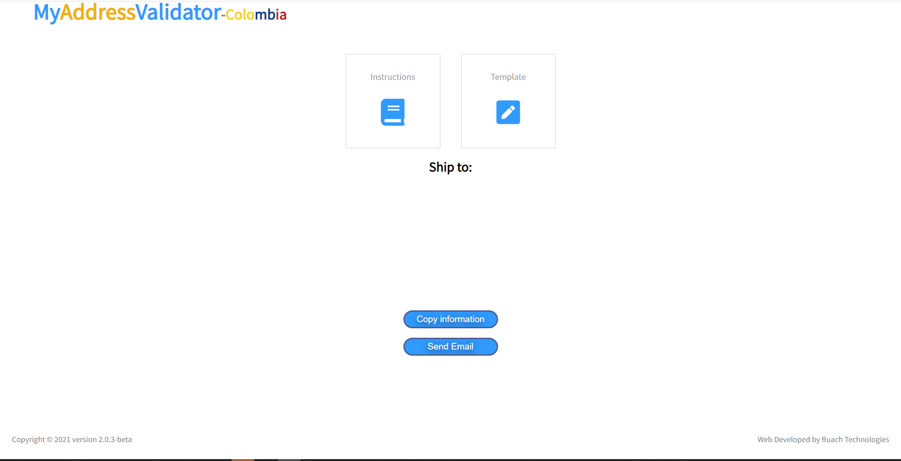

# My address validator

My address validator is a web application winner at *Dell Global Operations innovation Olympics 2021*, 

It is looking to accomplish:  

1. Input validation of customers information based on internal standards. 

2. Innovation in DELL Colombia. 

3. Mexico, Peru implementation during 2022. 

## USAGE

### landing page:
when you select a country implementation you might land on the following landing page, here you can: 
1. Read the instructions. 
2. Go to the template.
3. Copy to clipboard the template information.
4. Send via email the template information.

## IMPLEMENTATION
My address validator is built on a  free css template and pure JavaScript, during 2022 we are looking to migrate into  Reactjs but the priority is growing functionality. 
